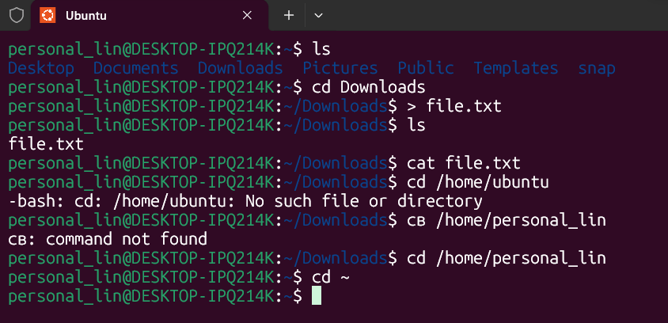
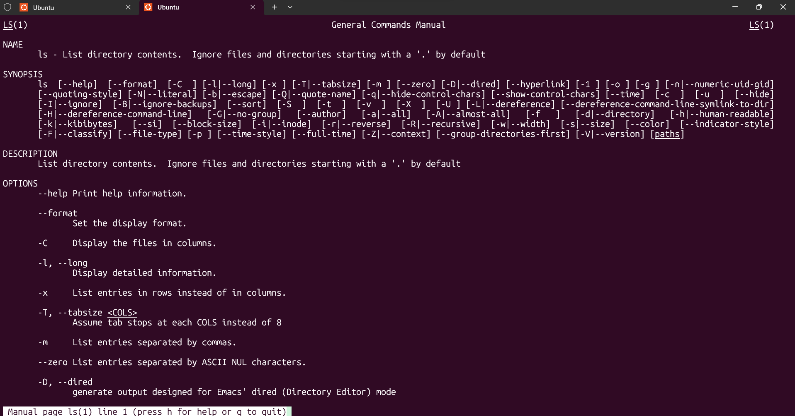
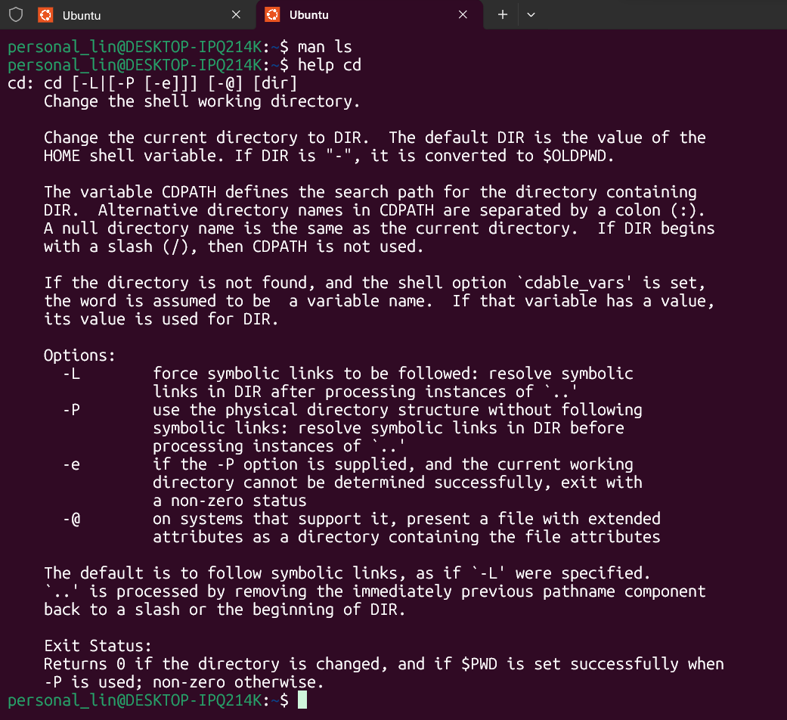
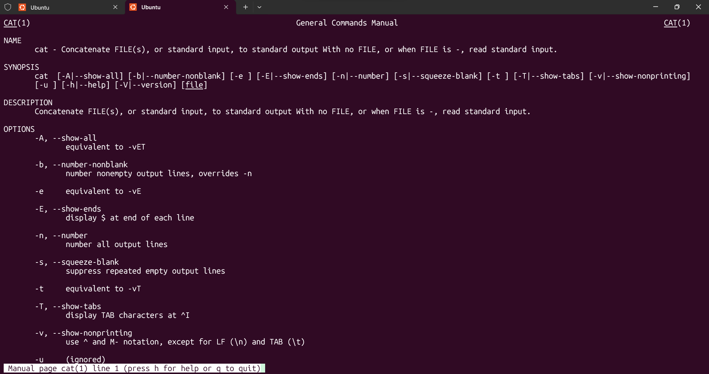
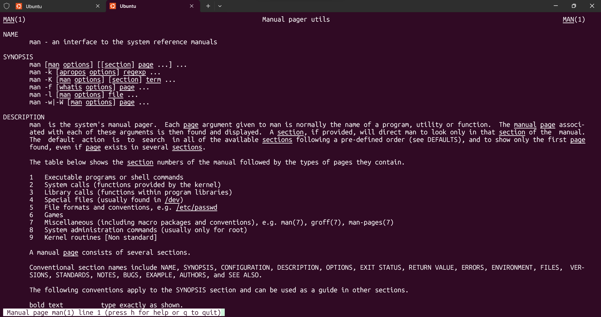
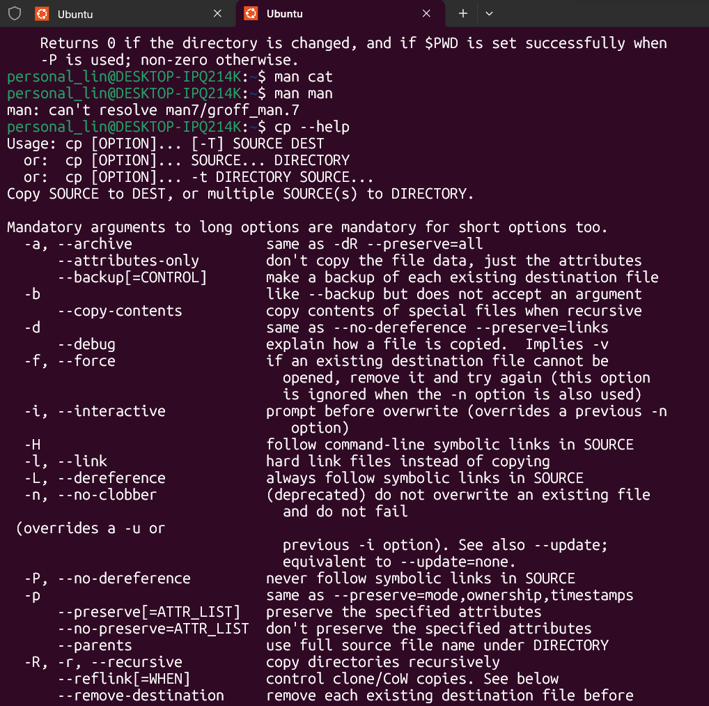
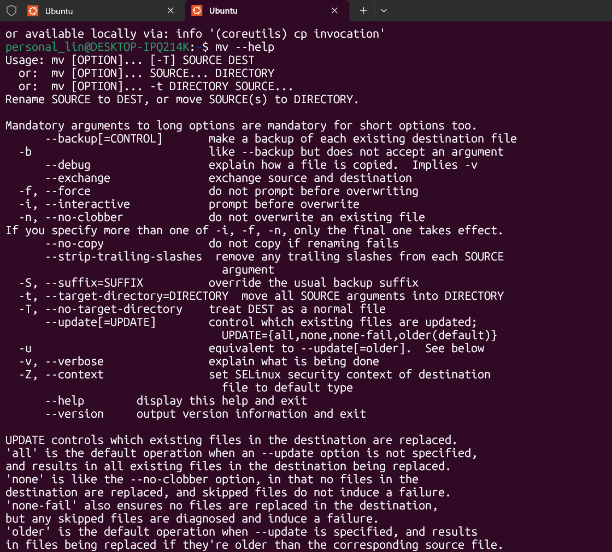

# Домашня робота №1

## Завдання 1. Базові команди

## Завдання 2. Робота з документацією

1. Який ключ ls показує приховані файли?   Ключ: ls -a
2. Який ключ у cat нумерує рядки?   cat -n 
3. Чим відрізняються man і --help?

   |man|--help|
   |-|-|
   |Повна документація|Коротка|
   |Детальний опис|Просто список ключів|
   |Окрема сторінка|Вивід у термінал|
   |Більше інформації|Швидкий перегляд|

## Завдання 3. Міні-сценарій

1. cd /home/ubuntu - перехід у домашній каталог
2. ls - перегляд файлів
3. \> file1.txt - створення файлу
4. ls - перевірка чи сторився
5. cd Downloads - перехід в інше місце 
6. ls - перегляд вмісту /Downloads
7. cd - - повернення назад
8. man ls - перегляд документації
