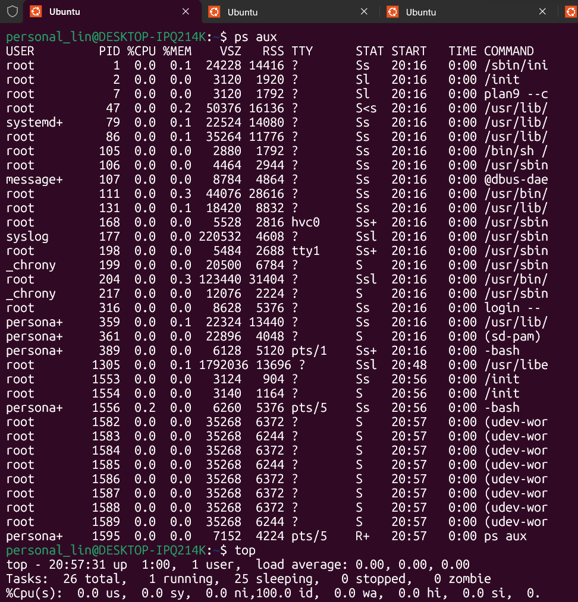
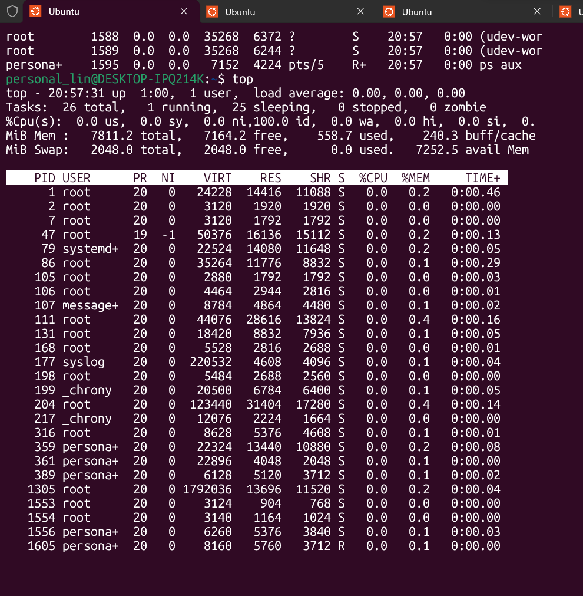
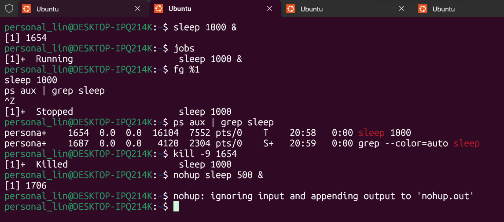
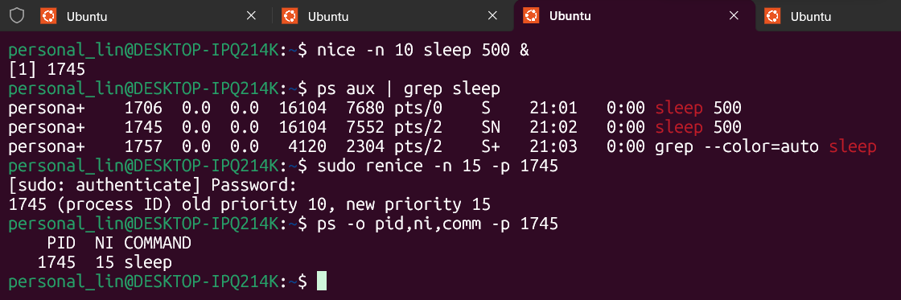
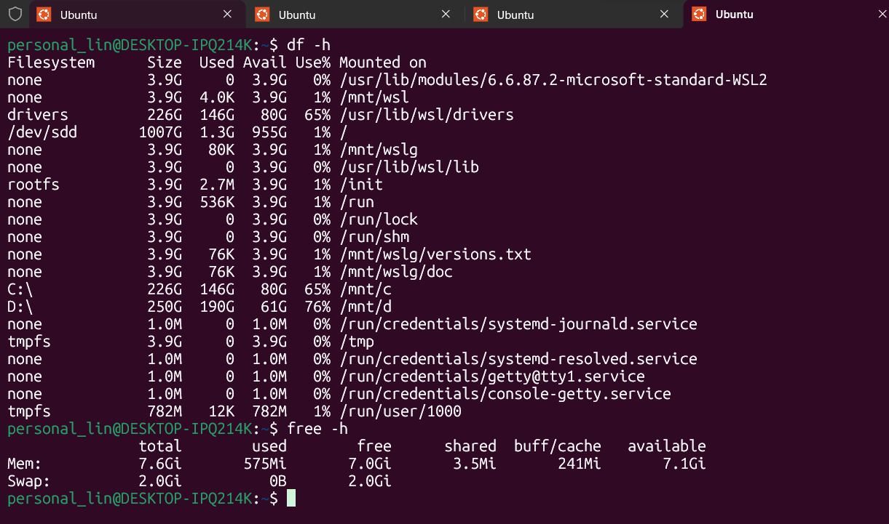

# Домашня робота №3.

## Завдання 1. Огляд активних процесів

---

## Завдання 2. Робота у фоні та керування процесами

---

## Завдання 3. Пріоритети та обмеження

---

## Завдання 4. Моніторинг ресурсів

